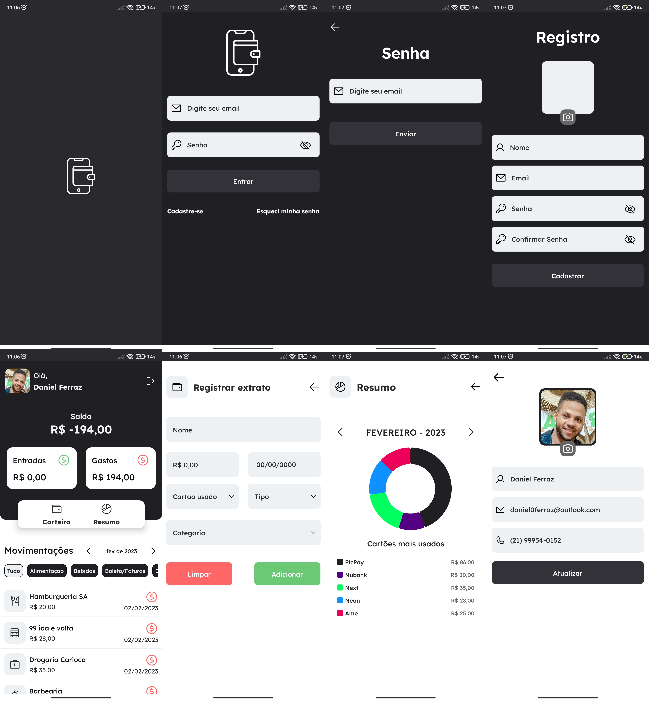

# 📱 Meus Gastos
Meus Gastos é um app que registra entrada e gastos pessoais em cartões, obtendo extrato do controle financeiro.

## 📑 Funcionalidades do App

• Login, Cadastro e Esqueci minha senha (enviando email para redefinição de senha).
• Criar novo extrato e Listagem de extrato possibilitando filtrar por categoria.
• Ver detalhes do extrato, possibilitado editar ou excluir.
• Atualizar informações no perfil do usuário.
• Resumo com gráfico informando cartões mais usados no mês.

## 🤖 Tecnologias

O App foi desenvolvido com React Native + Styled Components + Typescript + e alguns dos serviços do Firebase:
• Firebase Authentication.
• Cloud Firestore.
• Cloud Storage.
• App Distribution.
